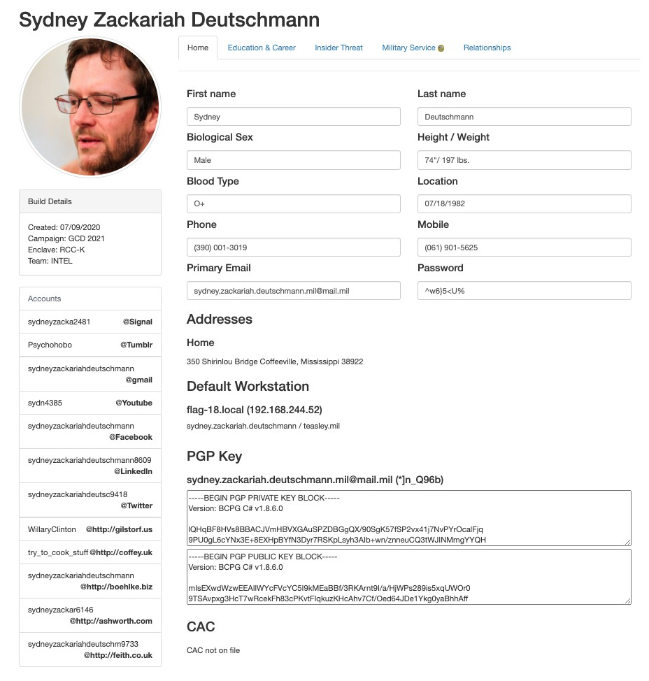
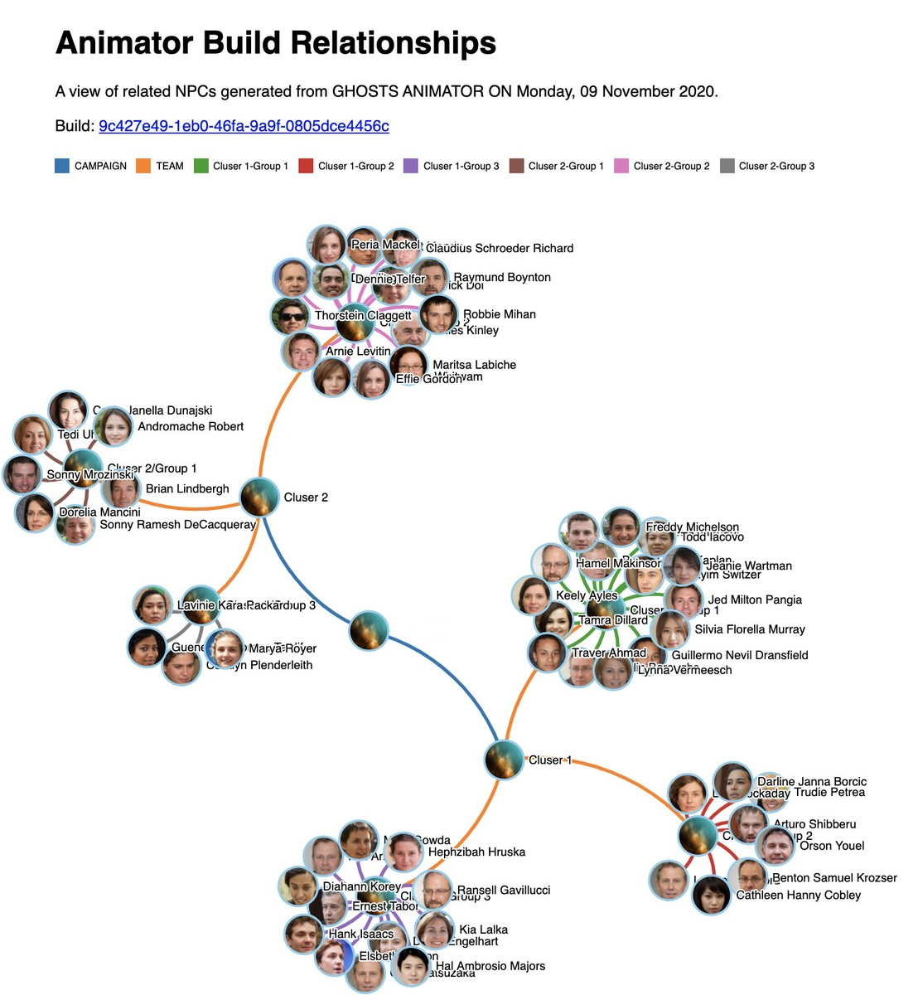

# GHOSTS Animator

A configurable and extensible library for generating modeling, simulation and exercise data.
"NPCs so real, they sell for a premium on the dark web."

At its core, Animator is a hyper-realistic user details generator.  Its primary function is to create fake identities and accompanying verbose portfolios of personal information.  Each generated user, or NPC (Non-Player Character) as we call them, has over 25 categories of details associated with them, and over a hundred pieces of metadata defining who they are.  Each piece of information is generated using sourced datasets in an attempt to distribute characteristics realistically.

 

## Quick Start

1. `git clone https://github.com/cmu-sei/GHOSTS-ANIMATOR`
2. `cd ghosts-animator/src`
3. `docker build . -t ghosts/animator`
4. `docker compose up -d`
5. Browse to `http://localhost:6001/swagger`

## Why Use Animator

The data generated by Animator can be leveraged in multiple areas, but is particularly applicable in four key areas:

**Training Machine Learning Algorithms** -
Animator creates larges sets of hyper-realistic user data.  It can be leveraged to generate data sets that can be used for training machine learning algorithms.  This enables the rapid training of anthropology related ML algorithms that can leverage one or more of the hundred plus data points generated by Animator.

**Honeypot Payloads** -
The motto "NPCs so real, they sell for a premium on the dark web" is not just a tagline.  NPC details generated by Animator are designed to be as realistic as possible given the available relevant open source information. This makes the user data convincingly real while still being completely fabricated. Therefore, the data is ideal for use in applications like honeypots, where the goal is to trick an attacker into thinking they are compromising an asset with real user data.  This data is also perfect for any other application that would benefit from extremely realistic user information.

**Insider Threat Modeling** -
Each Animator NPC is given an Insider Threat Profile.  This profile determines how likely it is tha the NPC is an insider threat by incorporating the CDSE's Insider Threat Potential Indicators.  As we continue developing Animator, it will be possible to configure NPCs to be more or less likely to be insider threats based on on factors like their finances, criminal history, foreign contacts, and mental health.

**Social Network and Relationship Modeling** -
Animator has the capability to establish relationships between the NPCs it generates.  As we increase the fidelity of inter-NPC relationships, Animator NPCs create larger and more realistic social networks.  By leveraging Animator's ability to quickly generate thousands of inter-related NPCs, Animator can easily be used to perform social networking modeling and research.

## How it Works

1. Animator is API built on .NET Core.  Once running, it stands up a server and Restful API that can be accessed to create NPCs.
2. Once Animator receives a request to create NPCs, it starts by creating an empty NPC Profile.
3. Animator then iterates through all 100+ data points for the NPC and generates synthetic data to be associated with that NPC.
    * Example data points are name, address, mental health, career, finances, and family members.
4. Data points are either generated at random, or are generated using weighted randomization.  Weighted randomization involves leveraging verified datasets to influence the distribution of randomly generated data points to match much more closely to reality.
    * Note that our primary goal in Animator is to be as realistic with our data as possible.  As we develop Animator, we aim to use weighted randomization for as many data points as we can find datasets for.
5. Animator will complete this process for as many users as were selected by the request.  This information can be exported through the API, or stored in a local database
    * Animator currently supports storing NPC data in a local Mongo Database.  This feature is still being actively improved.

## Sources:

Below are the sources we've used in Animator thus far:

* [Addresses](https://unitedstateszipcodes.org)
* Billets - //TODO
* [Insider Threat](https://www.cdse.edu/documents/toolkits-insider/INTJ0181-insider-threat-indicators-job-aid.pdf)
* [International Cities](https://datahub.io/core/world-cities)
* [First and Last Names](https://www.cs.cmu.edu/afs/cs/project/ai-repository/ai/areas/nlp/corpora/names/) via [Mark Kantrowitz](mkant+@cs.cmu.edu)
* Military Bases [1](https://en.wikipedia.org/wiki/List_of_United_States_military_bases),
[2](https://www.military.com/base-guide/browse-by-service/)
* MOS:
  * [Air Force](https://en.wikipedia.org/wiki/Air_Force_Specialty_Code)
  * Army [1](https://www.thebalancecareers.com/complete-list-of-army-enlisted-mos-s-3346173),
  [2](https://en.wikipedia.org/wiki/List_of_United_States_Army_careers)
  * [Coast Guard](https://en.wikipedia.org/wiki/List_of_United_States_Coast_Guard_ratings)
  * [Marines](https://en.wikipedia.org/wiki/List_of_United_States_Marine_Corps_MOS)
  * Navy [1](https://en.wikipedia.org/wiki/List_of_United_States_Navy_ratings),
  [2](https://en.wikipedia.org/wiki/List_of_Naval_Officer_Designators)
* [Ranks](https://www.defense.gov/Our-Story/Insignias/)
* [Service Branch Probabilities](https://www.statista.com/statistics/232330/us-military-force-numbers-by-service-branch-and-reserve-component/)
* Units
  * https://en.wikipedia.org/wiki/United_States_Army_Cyber_Command
  * https://en.wikipedia.org/wiki/Military_Intelligence_Corps_(United_States_Army)
  * https://en.wikipedia.org/wiki/780th_Military_Intelligence_Brigade_(United_States)
  * https://en.wikipedia.org/wiki/I_Corps_(United_States)
  * https://en.wikipedia.org/wiki/116th_Military_Intelligence_Brigade_(United_States)
  * https://en.wikipedia.org/wiki/1st_Cavalry_Division_(United_States)
  * https://en.wikipedia.org/wiki/289th_Engineer_Combat_Battalion_(United_States)
  * https://en.wikipedia.org/wiki/III_Corps_(United_States)
  * https://en.wikipedia.org/wiki/United_States_Army_Forces_Command
  * https://en.wikipedia.org/wiki/11th_Marine_Regiment_(United_States)
  * https://en.wikipedia.org/wiki/7th_Marine_Regiment_(United_States)
  * https://en.wikipedia.org/wiki/5th_Marine_Regiment_(United_States)
  * https://en.wikipedia.org/wiki/1st_Marine_Division_(United_States)
  * https://en.wikipedia.org/wiki/7th_Cavalry_Regiment_(United_States)
  * https://en.wikipedia.org/wiki/5th_Battalion,_11th_Marines
  * https://en.wikipedia.org/wiki/3rd_Battalion,_11th_Marines
  * https://en.wikipedia.org/wiki/2nd_Battalion,_11th_Marines
  * https://en.wikipedia.org/wiki/1st_Battalion,_11th_Marines
  * https://en.wikipedia.org/wiki/3rd_Battalion,_7th_Marines
  * https://en.wikipedia.org/wiki/2nd_Battalion,_7th_Marines
  * https://en.wikipedia.org/wiki/2nd_Battalion,_7th_Marines
  * https://en.wikipedia.org/wiki/1st_Battalion,_7th_Marines
  * https://en.wikipedia.org/wiki/3rd_Battalion,_5th_Marines
  * https://en.wikipedia.org/wiki/2nd_Battalion,_5th_Marines
  * https://en.wikipedia.org/wiki/1st_Battalion,_5th_Marines
  * https://en.wikipedia.org/wiki/1st_Battalion,_1st_Marines
  * https://en.wikipedia.org/wiki/United_States_Tenth_Fleet
[Job Titles](https://www.kaggle.com/HRAnalyticRepository/job-classification-dataset/data)
* Height and Weight
  * https://www.military.com/join-armed-forces/coast-guard-weight-rules.html
  * https://www.military.com/join-armed-forces/army-weight-rules.html
  * https://www.military.com/join-armed-forces/navy-weight-rules.html
  * https://www.military.com/military-fitness/marine-corps-fitness-requirements/usmc-weight-charts
  * https://www.military.com/military-fitness/air-force-fitness-requirements/air-force-height-and-weight-charts
  * https://www.thebalancecareers.com/us-military-enlistment-standards-3354017#:~:text=The%20cause%20for%20rejection%20for,The%20Marines%20are%20more%20restrictive.
  * https://www.nhlbi.nih.gov/health/educational/lose_wt/BMI/bmi_tbl.htm  
  * https://www.ajpmonline.org/article/S0749-3797(14)00505-4/pdf
  * https://dqydj.com/height-percentile-calculator-for-men-and-women/
  * https://www.cdc.gov/nchs/data/series/sr_11/sr11_224.pdf
  * https://www.niddk.nih.gov/health-information/health-statistics/overweight-obesity
  * https://www.diabetes.ca/managing-my-diabetes/tools---resources/body-mass-index-(bmi)-calculator#:~:text=Body%20Mass%20Index%20is%20a,range%20is%2018.5%20to%2024.9.
* Sex and Gender
  * https://www.americaspromise.org/us-military-demographics
* Education
  * https://qz.com/945083/new-research-suggests-it-really-does-pay-to-get-a-double-major-in-college/#:~:text=For%20example%2C%20looking%20at%20all,Survey%20(ACS)%20Census%20data.
  * https://en.wikipedia.org/wiki/Educational_attainment_in_the_United_States#Graduation_rates
  * https://github.com/arnaudbenard/university-ranking/blob/master/cwurData.csv
  * https://www.collegeraptor.com/college-majors/
[Usernames](https://www.kaggle.com/colinmorris/reddit-usernames?select=users.csv)

___

GHOSTS Animator began as a port of Faker.Net (https://github.com/jonwingfield/Faker.Net), which is itself a  
C# port of ffaker for ruby (https://github.com/EmmanuelOga/ffaker). Similar libraries exist for python, et al.
